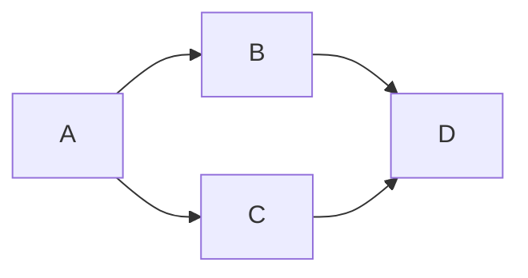
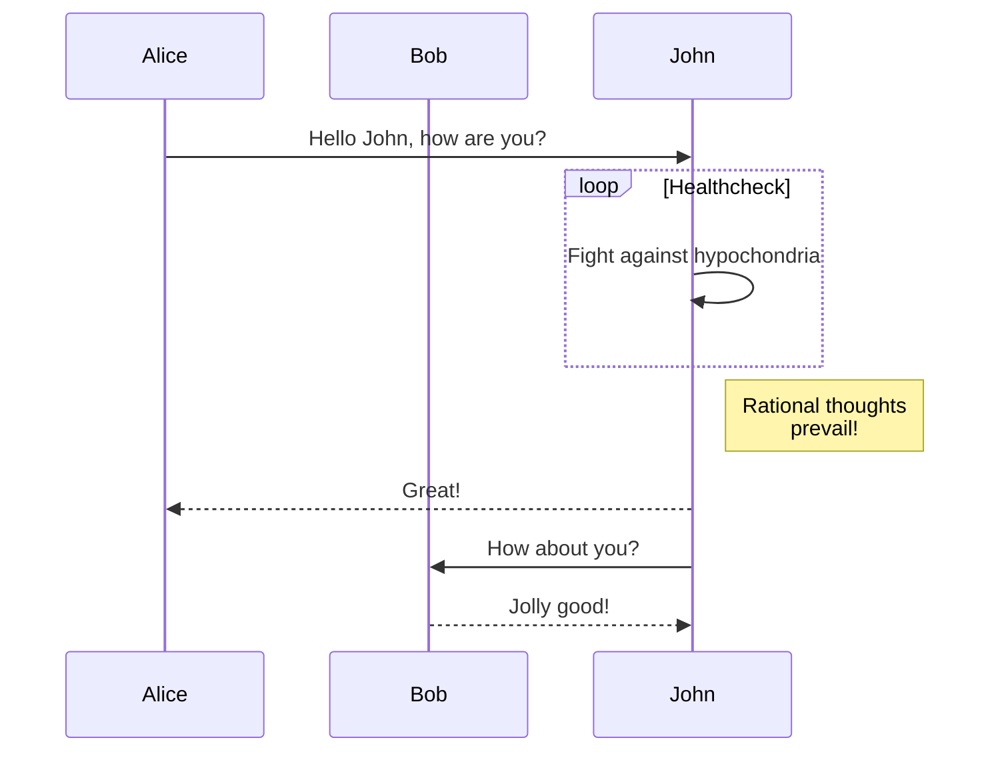

### Simple Left-Right Graph





The result is a diagram which is correctly rendered like this:

<pre class="mermaid">
flowchart TD
     A-->B
</pre>

If you want to see the raw source files for this, just take a look at the [source for this page](https://raw.githubusercontent.com/andykuszyk/andykuszyk.github.io/master/2023-05-03-yet-another-mermaid-in-github-pages-guide.md).

<script type="module">
	import mermaid from 'https://cdn.jsdelivr.net/npm/mermaid@10/dist/mermaid.esm.min.mjs';
	mermaid.initialize({
		startOnLoad: true,
		theme: 'dark'
	});
</script>


```goat
      .               .                .               .--- 1          .-- 1     / 1
     / \              |                |           .---+            .-+         +
    /   \         .---+---.         .--+--.        |   '--- 2      |   '-- 2   / \ 2
   +     +        |       |        |       |    ---+            ---+          +
  / \   / \     .-+-.   .-+-.     .+.     .+.      |   .--- 3      |   .-- 3   \ / 3
 /   \ /   \    |   |   |   |    |   |   |   |     '---+            '-+         +
 1   2 3   4    1   2   3   4    1   2   3   4         '--- 4          '-- 4     \ 4

```